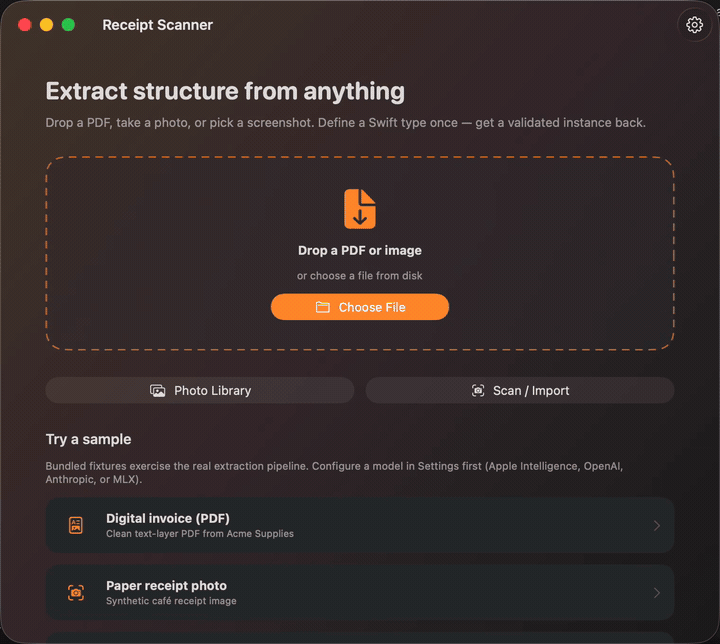

# swift-extract

**Define a Swift type. Point the library at anything — a PDF, a receipt photo, an ID document, a screenshot, or plain text — and get back a fully typed, validated instance.**

Powered by any LLM: Apple Intelligence on-device, MLX / Core ML / llama.cpp locally, or OpenAI / Anthropic / Gemini in the cloud — via [AnyLanguageModel](https://github.com/huggingface/AnyLanguageModel).

[](https://github.com/asaptf/swift-extract/actions/workflows/ci.yml)
[](https://swiftpackageindex.com/asaptf/swift-extract)
[](https://swiftpackageindex.com/asaptf/swift-extract)


```swift
import Extract

@Extractable
struct Invoice {
    let vendor: String
    @Guide("ISO 8601 format") let dueDate: Date
    let total: Decimal
    let lineItems: [LineItem]
}

let invoice: Invoice = try await Extract.from(pdfURL)
```



*The [ReceiptScanner demo](Examples/ReceiptScanner/README.md) running a café receipt through the real pipeline — Vision OCR, then a local **MLX** model (Qwen2.5 1.5B, 4-bit) generating the typed `Receipt`. Fully on-device, no network. The spinner is sped up 4×; everything else is real time.*

---

## Why swift-extract?

**The Python stack works — until you ship to a phone.**  
Instructor + unstructured + OCR glue is the de-facto pattern for structured LLM output. On iOS/macOS that usually means a backend: network latency, cost per page, and receipts leaving the device.

**On-device models change the product equation.**  
Apple Foundation Models, MLX, and llama.cpp make private, offline extraction realistic. Cloud models stay one configuration flip away when you need max quality.

**Swift is ready now.**  
Macros give compile-time schemas (no `Mirror`). Vision and PDFKit are first-party. [AnyLanguageModel](https://github.com/huggingface/AnyLanguageModel) unifies providers with an API close to Apple’s Foundation Models. **swift-extract** is Instructor for Swift — document-first and multimodal.

---

## A general-purpose extractor, not a receipt scanner

The demo happens to scan a receipt, but nothing in the library knows what a receipt *is*. There is no
built-in document taxonomy, no per-vendor templates, no trained document classifier. The pipeline is
document-agnostic end to end:

**any source → text → your `@Extractable` type**

The only thing that describes your domain is the Swift type you declare. Swap the type and you have
changed the extractor — no new parser, no retraining, no template to maintain.

```swift
// Same call. The return type is the entire configuration.
let receipt:  Receipt              = try await Extract.from(photoURL,  using: session)
let invoice:  Invoice              = try await Extract.from(pdfURL,    using: session)
let passport: IdentityDocument     = try await Extract.from(scanURL,   using: session)
let shipment: ShippingConfirmation = try await Extract.from(emailBody, using: session)
```

### What people extract with it

| Domain | Typical type | Notes |
| --- | --- | --- |
| **Receipts & invoices** | `Receipt`, `Invoice` | Line items, totals, tax, currency — see the [cookbook](docs/Examples.md) |
| **Identity documents** | `IdentityDocument` | Passports, national IDs, driver licenses, residence permits — [schema](Examples/schemas/IdentityDocument.swift), [recipe](docs/Examples.md#3-identity-document-passport--id--driver-license). Read the privacy notes below |
| **Email & confirmations** | `ShippingConfirmation` | Order numbers, dates, addresses from free-form text |
| **Forms & applications** | your own | Scanned or digital; optional fields decode as `nil` when a box is blank |
| **Tickets & boarding passes** | your own | Codes, times, seat/gate, passenger name |
| **Contracts & statements** | your own | Long documents chunk and merge automatically |
| **Anything else printed** | your own | Business cards, lab reports, shipping labels, meter readings, menus |

The last row is the point: those are not features we shipped, they are types a user declared.

### What makes it general

- **Any input.** PDFs (text layer or scanned), photos and screenshots via Vision OCR, and plain
  strings — one `ExtractionSource` enum, [same entry point](docs/API.md).
- **Any shape.** Nested structs, arrays, optionals, string-backed enums, `Date`/`Decimal`/`URL`.
  Unsupported types fail at **compile time**, not at runtime — see [Supported property types](#supported-property-types).
- **Any language.** Document text may be Chinese, Arabic, Japanese, and more — see
  [Languages & scripts](#languages--scripts).
- **Any model.** Apple Intelligence, MLX, Core ML, llama.cpp locally, or OpenAI / Anthropic / Gemini
  in the cloud. The schema and the retry loop do not change when you switch.

### How much can you trust a result?

Structured extraction fails at the validation boundary, not on the happy path. A malformed
response is easy to catch; a well-typed wrong one is the problem. Four answers, in descending
order of how much they actually prove:

**Arithmetic — `MRZParser`.** Where a document has a machine-readable zone, the fields are parsed
directly and every ICAO 9303 check digit is verified. No model in the loop, so those fields are
computed rather than inferred. See [MRZ](docs/Examples.md).

**Enforced — `validateInvariants()`.** Declare semantic constraints on your own type in plain Swift
(line items + tax ≈ total, expiry after issue). A violation is treated like a decode failure: the
specific complaint goes back to the model, which retries, and the call throws if it cannot be
satisfied. So if a type declares invariants and you received a value, those invariants held.

```swift
func validateInvariants() throws {
    let expected = items.reduce(0) { $0 + $1.price } + tax
    guard Extract.isApproximatelyEqual(total, to: expected) else {
        throw InvariantValidationError(path: "total", expected: "\(expected)", found: "\(total)")
    }
}
```

**Evidence — `result.signals`.** Per field, whether the value was actually found in the source text
(`verbatim`, `normalized`, `reformatted`, `absent`), plus attempt and chunk counts. There is
deliberately **no confidence score**: nothing behind one would be calibrated, and a single number
gets thresholded for auto-accept. Note the limit — `absent` only fires for text fields, since a
`quantity: 2` matches almost any document. A confidently wrong *number* is caught by invariants,
not by grounding.

**Provenance — `field.provenance`.** When a leaf was found in positioned geometry (PDF text layer
or Vision OCR), the same signal row carries a **page index and normalised bounding box** so a
review UI can highlight the source rectangle instead of asking the operator to re-read the
document. Coordinates use one convention for both ingestion paths: **top-left origin, y down,
normalised `0…1`, per page**. Multi-line values union their blocks; cross-page values report the
first page only. Table-cell matches prefer the tighter cell rect. `reformatted` / `absent` leaves
and plain-text sources carry `nil` provenance — never a guess. The library returns geometry only;
it does not draw. See [API → Extraction signals](docs/API.md#extraction-signals-grounding).

### Identity documents & sensitive data

ID recognition is a first-class use case, with caveats worth stating plainly:

- **Prefer on-device backends** (Apple Intelligence or MLX) for real documents, so images and personal
  data never leave the device. This is the main reason the library exists.
- **Use synthetic or redacted samples** in fixtures, tests, logs, and screenshots. The bundled
  [`fixtures/identity_document.txt`](fixtures/identity_document.txt) is entirely fictional.
- **This is not a KYC or identity-verification product.** MRZ check digits *are* verified, which
  catches transcription and OCR errors on the fields the MRZ carries. That is all it catches: there
  is no ePassport NFC/chip reading, no biometrics, no forgery or liveness detection, no
  certification. Fields that live only in the visual zone still come from an LLM — treat them as
  *model output that needs review*, and keep a human in the loop for decisions that affect someone.

---

## Contents

| Doc | What it covers |
| --- | --- |
| [Getting started](docs/GettingStarted.md) | Install, first extraction, backends |
| [API reference guide](docs/API.md) | Macros, sources, session, options, errors |
| [Examples cookbook](docs/Examples.md) | Receipts, invoices, **ID documents**, multilingual docs, emails, retries, tests |
| [Backends & traits](docs/Backends.md) | Apple Intelligence, MLX, OpenAI, Anthropic, SPM traits |
| [ReceiptScanner demo](Examples/ReceiptScanner/README.md) | One-click Xcode project |

---

## Install

### Swift Package Manager

```swift
// Package.swift
dependencies: [
    .package(url: "https://github.com/asaptf/swift-extract.git", from: "0.1.0")
]
```

```swift
.target(
    name: "MyApp",
    dependencies: [
        .product(name: "Extract", package: "swift-extract")
    ]
)
```

In Xcode: **File → Add Package Dependencies…** and paste the repository URL.

**Requirements:** Swift 6.1+, iOS 17+ / macOS 14+.

---

## 60-second tour

### 1. Mark your type

```swift
import Extract
import Foundation

@Extractable
struct Receipt {
    let merchant: String
    let date: Date
    let total: Decimal
    @Guide("3-letter ISO currency code") let currency: String
    let items: [Item]

    @Extractable
    struct Item {
        let name: String
        let price: Decimal
        @Guide("null if not printed on the receipt") let quantity: Int?
    }
}
```

### 2. Configure a model

```swift
import AnyLanguageModel

// Cloud
let session = ExtractionSession(
    model: OpenAILanguageModel(apiKey: apiKey, model: "gpt-4o-mini")
)

// Or on-device when available (iOS 26 / macOS 26 + Apple Intelligence)
// let session = ExtractionSession.default
```

### 3. Extract

```swift
// From a PDF
let receipt: Receipt = try await Extract.from(pdfURL, using: session)

// From plain text
let receipt: Receipt = try await Extract.from(emailBody, using: session)

// From an image file
let receipt: Receipt = try await Extract.from(
    try ExtractionSource.image(url: photoURL),
    using: session
)

// With metadata (attempts, raw model output)
let result = try await Extract.detailed(from: .pdf(pdfURL), using: session)
print(result.value.total, result.attempts, result.rawModelOutput)
```

### 4. Handle errors

```swift
do {
    let invoice: Invoice = try await Extract.from(url, using: session)
} catch let error as ExtractionError {
    switch error {
    case .emptyDocument:
        print("Nothing to extract")
    case .modelUnavailable(let message):
        print("Configure a model: \(message)")
    case .validationFailed(let attempts, let last, let raw):
        print("Failed after \(attempts) tries: \(last)\n\(raw)")
    case .unreadableSource(let underlying):
        print("Could not read file: \(underlying?.localizedDescription ?? "?")")
    default:
        print(error.localizedDescription)
    }
}
```

---

## Package traits (optional heavy backends)

Default build is **lightweight**: text + PDFKit + Vision OCR + cloud/Apple backends.

| Trait | Backend | When you need it |
| --- | --- | --- |
| `MLX` | Local MLX models | Apple Silicon offline inference |
| `CoreML` | Core ML models | On-device Core ML LLMs |
| `Llama` | llama.cpp / GGUF | Local GGUF models |

```swift
.package(
    url: "https://github.com/asaptf/swift-extract.git",
    from: "0.1.0",
    traits: ["MLX"]
)
```

### SPM trait resolution workaround

If enabling traits fails with *“exhausted attempts to resolve the dependencies graph”* ([swift-package-manager#9286](https://github.com/swiftlang/swift-package-manager/issues/9286) / [AnyLanguageModel#135](https://github.com/huggingface/AnyLanguageModel/issues/135)), also declare the underlying packages:

```swift
dependencies: [
    .package(
        url: "https://github.com/asaptf/swift-extract.git",
        from: "0.1.0",
        traits: ["MLX", "CoreML", "Llama"]
    ),
    .package(url: "https://github.com/ml-explore/mlx-swift-lm", from: "2.25.5"),       // MLX
    .package(url: "https://github.com/huggingface/swift-transformers", from: "1.0.0"), // CoreML
    .package(url: "https://github.com/mattt/llama.swift", from: "2.0.0"),              // Llama
]
```

---

## CLI

```bash
# Offline / CI (deterministic mock model)
swift run extract-cli fixtures/invoice.pdf \
  --schema Examples/schemas/Invoice.swift \
  --mock

# Identity document (synthetic fixture — never use real PII)
swift run extract-cli fixtures/identity_document.txt \
  --schema Examples/schemas/IdentityDocument.swift \
  --mock

# Live (uses ExtractionSession.default when Apple Intelligence is available)
swift run extract-cli fixtures/invoice.pdf --type Invoice
```

Supported embedded schema types: `Invoice`, `Receipt`, `IdentityDocument`.

---

## Demo app

Open **one click**:

```text
Examples/ReceiptScanner/ReceiptScanner.xcodeproj
```

Or from the command line:

```bash
cd Examples/ReceiptScanner
open ReceiptScanner.xcodeproj
# or: swift run ReceiptScanner
```

Bundled fixtures: digital invoice PDF, café receipt image, email screenshot. Configure Apple Intelligence, OpenAI, Anthropic, or MLX in **Settings**. No hardcoded extraction results.

---

## Supported property types

| Type | Schema | Notes |
| --- | --- | --- |
| `String` | string | Whitespace trimmed |
| `Bool` | boolean | Also `"yes"` / `"1"` |
| Integers / floats / `Decimal` | integer / number | `Decimal` accepts `"$1,234.50"` |
| `Date` | string `date-time` | ISO-8601 + common human formats |
| `URL` | string `uri` | |
| `Optional` / `Array` | — | Nested as expected |
| Nested `@Extractable` | object | |
| String `CaseIterable` enums | string enum | Conform to `Extractable` |

Unsupported types (`UUID`, `Data`, dictionaries, …) produce a **compile-time** diagnostic.

---

## Languages & scripts

Document content can be in **many languages**, not only English — including **Chinese (Simplified/Traditional)**, **Arabic**, Japanese, Korean, and other scripts Vision and your model support.

| Stage | How multilingual works |
| --- | --- |
| Plain text / PDF text layer | Unicode as-is; Chinese, Arabic, and other scripts pass through unchanged |
| Image / scanned PDF OCR | Apple Vision (`VNRecognizeTextRequest`) — multi-script; quality depends on OS language packs and image quality |
| LLM field extraction | Any multilingual backend (OpenAI, Anthropic, Gemini, Apple Intelligence, capable local models) maps non-English text into your typed schema |

```swift
// Chinese receipt, German invoice, Arabic ID — same API
var options = ExtractionOptions()
options.locale = Locale(identifier: "zh_CN")  // date/number parsing + prompt hint
let receipt: Receipt = try await Extract.from(photoURL, using: session, options: options)
```

**Practical notes**

- Schema `@Guide`s and the extraction prompt are **English-first**; the model still reads multilingual *document* text and fills English-named (or any Unicode) fields.
- Set `ExtractionOptions.locale` when dates/numbers are locale-specific (e.g. `dd/MM/yyyy`, Arabic-Indic digits, Chinese date formats).
- OCR for Arabic (RTL) and dense CJK works on supported devices, but reading-order heuristics are LTR-oriented; prefer a clear scan and a strong model for best field mapping.
- Field *values* may stay in the document language (`merchant: "星巴克"`, `fullName: "محمد …"`) unless your guides ask the model to transliterate or translate.

---

## Limitations (v0.2)

- Handwriting OCR quality is not guaranteed.
- Table reconstruction is geometric (OCR/PDF positions), not a trained table model.
  Under `tableDetection: .automatic`, grids are exposed on `result.tables` always,
  but appended to the prompt as Markdown **only when the target schema contains a
  collection** (array). Header-only types get a prompt byte-identical to `.off`.
  Cell merge is lossy (no spanning or nested cells, no cross-page merge); header
  detection is keyword-based and often absent; skewed scans break it. Linear
  document text is always kept — tables are additive, never a substitute.
- Grounding reports `absent` only for text fields; numeric and date fields never do. Use
  [invariants](#how-much-can-you-trust-a-result) to catch a wrong number.
- Chunk-and-merge on long documents is the least exercised path in the library.
- Prompts and built-in guides are English-first (document content can still be multilingual — see [Languages & scripts](#languages--scripts)).
- Guided generation uses schema-in-prompt (AnyLanguageModel’s `respond(to:schema:)` is not used; see `DECISIONS.md`).
- CLI does not JIT-compile arbitrary `.swift` schema files; use embedded types matching `Examples/schemas/`.

---

## Roadmap

- [ ] Audio input (Speech framework)
- [ ] Streaming partials for `@Extractable`
- [x] Per-field provenance (bounding boxes on `FieldSignal.provenance`)
- [x] Evaluation harness (`Tools/EvalHarness/` — survey, Factur-X accuracy, A/B, anchors)
- [ ] First-class guided-generation bridge when AnyLanguageModel passes schemas through

Architecture notes: [`DECISIONS.md`](DECISIONS.md).

---

## Development

```bash
swift build
swift test
swift run extract-cli fixtures/invoice.pdf --schema Examples/schemas/Invoice.swift --mock
swift run extract-cli fixtures/identity_document.txt --type IdentityDocument --mock
swift format lint --configuration .swift-format --recursive Sources Tests
```

**Evaluation harness** (separate package — not built by root `swift build`):

```bash
cd Tools/EvalHarness
swift run extract-eval --mode survey --repo-root ../.. --fixtures ../../fixtures --backend mock
swift run extract-eval --mode accuracy --repo-root ../.. --fixtures ../../fixtures --backend mock
```

See [`Tools/EvalHarness/README.md`](Tools/EvalHarness/README.md) for corpus setup, anchors, A/B, and MLX.

See [CHANGELOG.md](CHANGELOG.md) for release notes.

---

## License

Licensed under the **Apache License, Version 2.0**. See [LICENSE](LICENSE) and [NOTICE](NOTICE).

---

## Package identity

| | |
| --- | --- |
| Repository | https://github.com/asaptf/swift-extract |
| Package name | `swift-extract` |
| Library product | `Extract` |
| License | Apache-2.0 |

```swift
import Extract
```

Indexed on the [Swift Package Index](https://swiftpackageindex.com/asaptf/swift-extract).